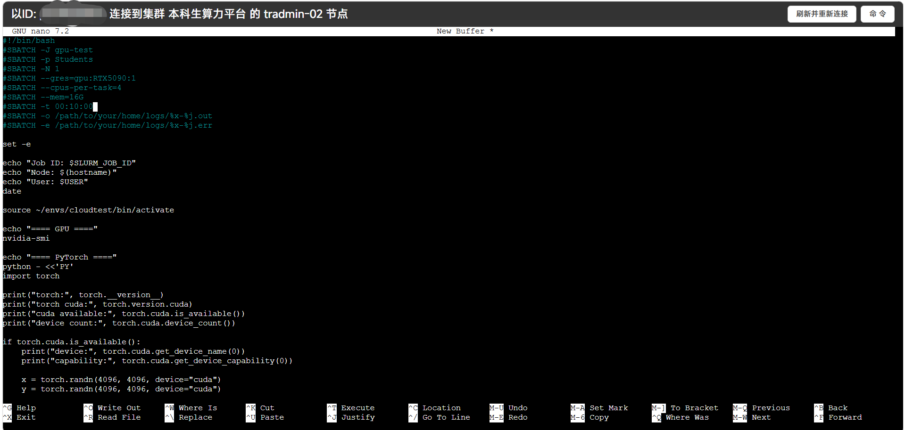
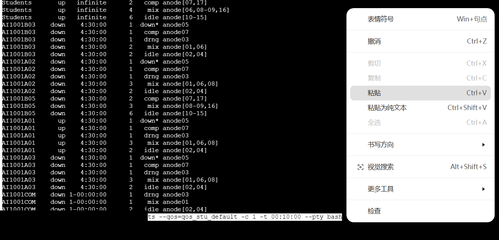
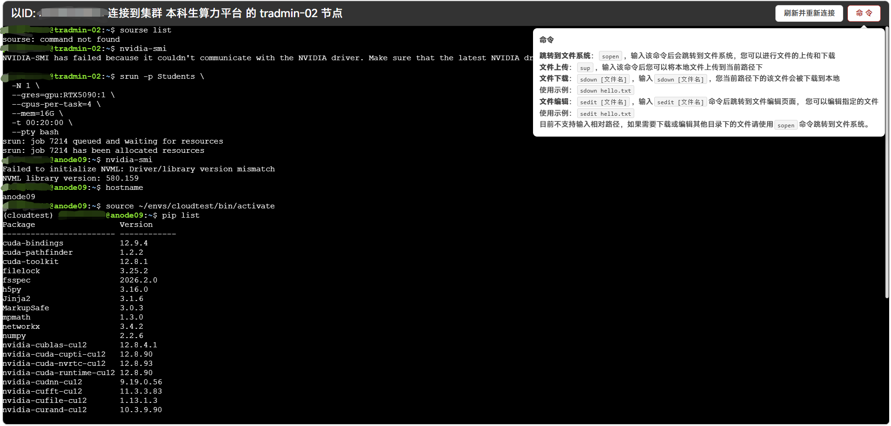

# 命令行使用

命令行不是为了增加门槛，而是为了让任务可复制、可检查、可复现。你不需要一次学完 Linux，只要先掌握目录、文件、环境和作业相关的少量命令。

常用命令的集中解释见 [CLI 命令索引](cli-index.md)。

## 必须知道

- 先确认当前在哪里：`pwd`。
- 再确认目录里有什么：`ls`。
- 修改文件前先知道文件路径。
- 运行长任务前先确认是在计算节点或 Slurm 作业里，不要直接压登录节点。

## 常用命令

运行环境：平台 Shell。

```bash
pwd                 # 显示当前目录
ls -lh              # 查看当前目录文件
cd ~/projects       # 进入目录
mkdir -p logs       # 创建目录
cp a.txt b.txt      # 复制文件
mv old.txt new.txt  # 移动或重命名文件
tail -n 50 file.log # 查看日志最后 50 行
```

??? note "命令解释"
    `~` 通常表示你的用户主目录。`-lh` 会用更易读的方式显示文件大小。`tail` 适合快速查看日志结尾的报错。

## 编辑小文件

如果需要在终端里快速编辑脚本，可以使用平台已有编辑器。常见选择包括 `nano`、`vim` 或网页文件编辑器。

运行环境：平台 Shell。

```bash
nano train.sbatch
```

检查点：保存后用 `ls -lh train.sbatch` 能看到文件，用 `sed -n '1,40p' train.sbatch` 能检查前 40 行内容。



!!! note "截图说明"
    图中展示了在 Web 终端里用 `nano` 编辑一个脚本文件。`#SBATCH` 开头的行是 Slurm 作业参数示例，初学者第一次不需要完全掌握；可以先知道它们用于描述作业名、日志、分区、GPU、运行时间等信息，遇到具体脚本时再查文档或询问 AI 逐行解释。

## VS Code 工作区

VS Code 是平台上常用的编程入口。VS Code 的 workspace 可以理解为“当前打开的项目文件夹”。建议打开代码所在目录，而不是只打开单个文件，这样终端默认目录、相对路径和运行脚本会更清晰。

检查点：VS Code 左侧文件列表显示你的项目目录，终端中 `pwd` 输出的是同一个项目目录或它的子目录。

运行 Python 文件时，有两种常见方式：

- 在 VS Code 中选择解释器后点击运行按钮。
- 在终端中先 `conda activate <env>`，再运行 `python 文件名.py`。

如果终端不在代码所在目录，先用 `cd /path/to/project` 进入项目目录。

## 短期进入计算节点

登录集群 Shell 通常位于登录节点，适合整理文件、编辑脚本和提交作业，不适合直接运行重计算任务。需要短时间测试计算环境时，可以用 `srun --pty bash` 申请一个交互式计算节点 Shell。

运行环境：平台 Shell。

```bash
srun -p Students --qos=qos_stu_default -c 1 -t 00:10:00 --pty bash
```

进入后可以运行：

```bash
hostname
python -V
exit
```

需要临时检查 GPU 时，可以申请 1 张 GPU：

```bash
srun -p Students --qos=qos_stu_default --gres=gpu:1 -c 1 -t 00:10:00 --pty bash
nvidia-smi
exit
```

??? note "命令解释"
    `srun` 会向 Slurm 申请资源；`--pty bash` 表示分配成功后打开一个交互式 Shell；`-t 00:10:00` 表示最长 10 分钟；`exit` 会退出并释放资源。分区、QOS、GPU 类型和可用时长会变化，提交前以平台页面或 `scontrol show part` 的结果为准。

!!! warning "不要把长任务放在这里"
    交互式会话适合临时调试。训练、仿真和批量实验应写成 `sbatch` 脚本提交，避免浏览器、网络或 Web Shell 断线影响任务。

## SSH 与文件传输

当前平台主线流程以 Web GUI、文件管理、登录集群 Shell 和 Slurm 作业为准；如果页面或课程通知没有提供 SSH 入口，不要假设可以直接用本地 `ssh` 登录。

如果未来开放 SSH，通常会涉及：

- 本地生成或选择 SSH 密钥。
- 在平台登记公钥。
- 使用 `ssh` 登录。
- 使用 `scp`、`rsync` 或 SFTP 传输文件。

当前如果需要上传下载文件，先使用 GUI 文件管理。大目录建议打包后上传，避免大量小文件传输失败。

## Web 终端限制

Web 终端适合短时间操作，但它受浏览器、网络和操作系统快捷键影响。常见现象包括：

- Web 终端可能断线。
- 部分组合键可能被浏览器或系统拦截。
- `Ctrl+C` 在终端中通常表示中断当前程序，不是复制；`Ctrl+V` 也可能被浏览器或终端组件拦截。
- Mac 上某些 `Ctrl + 方向键` 组合可能不会传入终端。

实际测试中，Web Shell 可以通过鼠标选中文字后右键选择复制，也可以在终端区域右键选择粘贴。建议把长任务写成批处理作业。需要维持交互式会话时，可以尝试使用 `tmux`，并在快捷键冲突时调整 tmux keybinding。



!!! note "截图说明"
    图中展示了浏览器右键菜单中的“粘贴”和“粘贴为纯文本”。如果键盘快捷键不可用，优先使用右键菜单完成复制和粘贴。



!!! note "截图说明"
    图中展示了 Web Shell 中的命令行会话，以及右上角“命令”帮助入口。`srun`、`nvidia-smi`、`pip list` 等命令常用于交互式调试或排查环境，不需要在入门阶段一次掌握；可以先按本文主线完成目录、文件和作业提交，遇到问题时再查询或询问 AI 初步理解命令含义。

## 检查点

- 你能说清当前命令是在本地电脑、平台 Shell、登录节点还是计算节点运行。
- 你能用 `pwd` 和 `ls` 找到项目目录。
- 你能用 `tail` 查看日志。
- 你知道哪些任务应该提交给 Slurm，而不是直接在登录 Shell 中运行。
