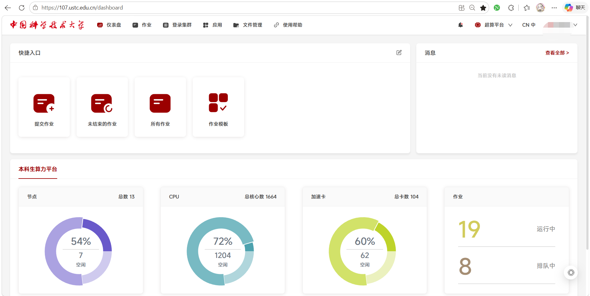
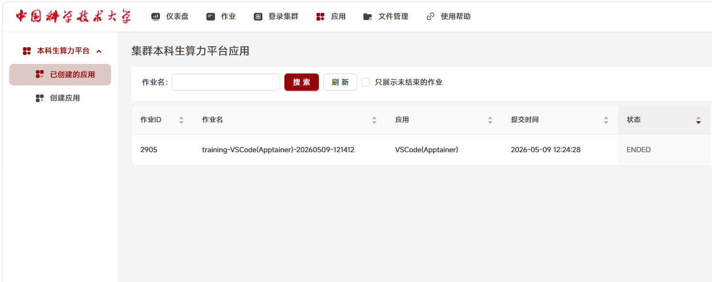
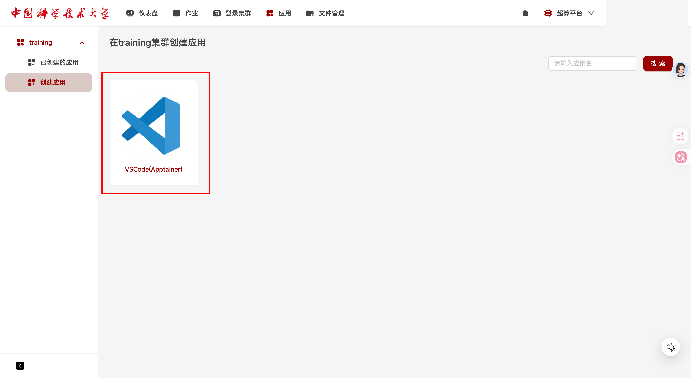
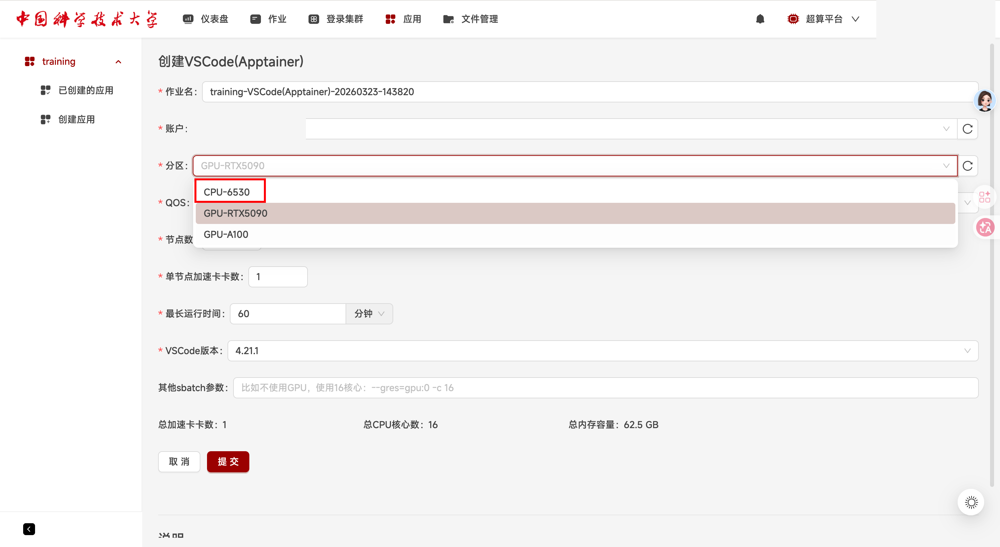
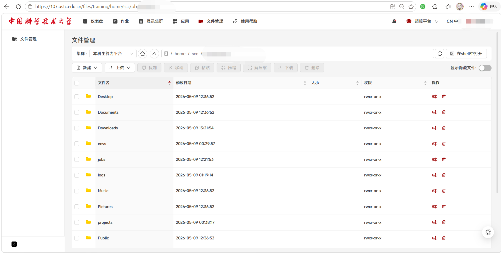
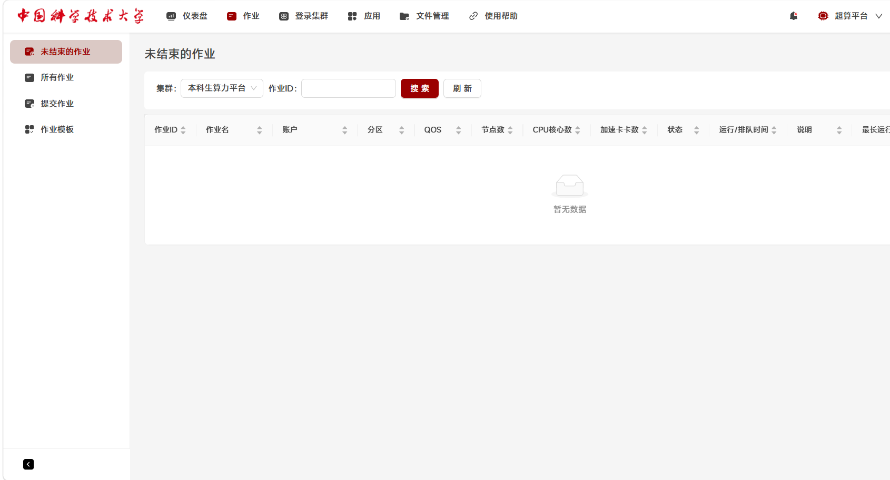
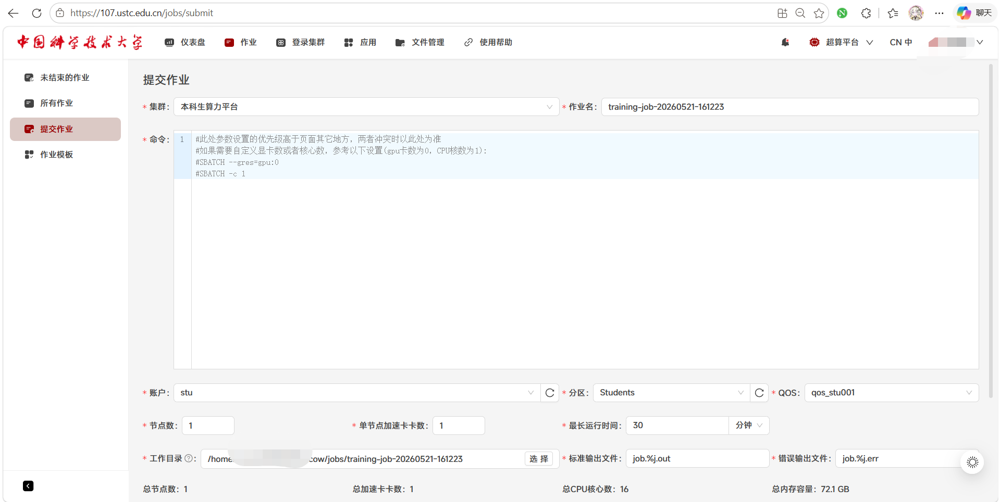
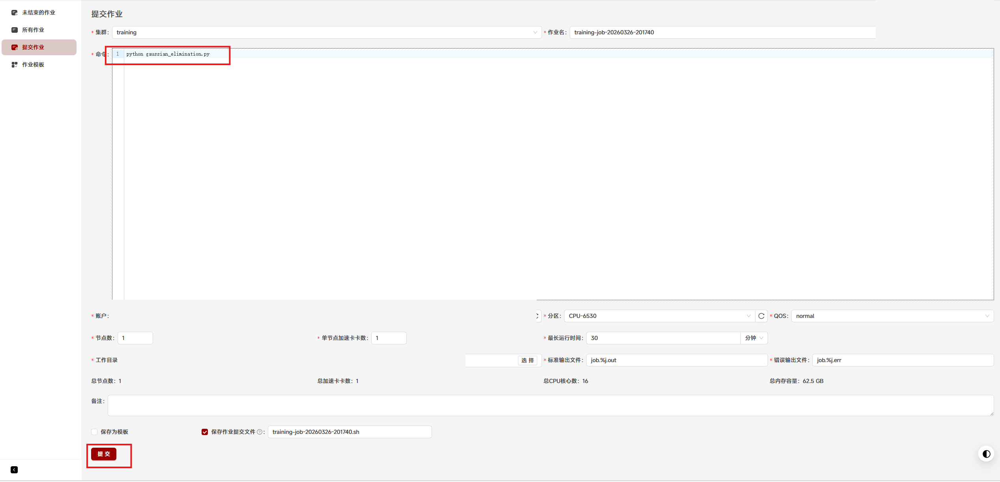
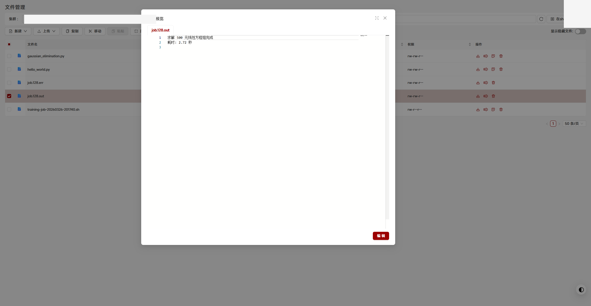

# GUI 使用

GUI 适合第一次进入平台、创建 VS Code 应用、上传下载文件、查看作业状态和复制关键信息。即使后续主要使用命令行，也建议先熟悉 GUI 中的入口和字段。

## 第一次进入后检查什么

平台正式入口：<https://107.ustc.edu.cn/>。账号和登录方式以平台页面、课程通知或助教说明为准；如果登录失败，不要反复尝试大量密码，应及时联系课程助教或平台管理员。

登录平台后，建议先确认：

- 你能看到自己的用户信息或账号标识。
- 顶部或侧边栏有“应用”“作业”“登录集群”“文件管理”等入口。
- 有文件管理入口，能进入自己的工作目录。
- 有 Shell、终端或登录集群入口。
- 有作业、任务、队列或资源使用情况入口。
- 有资源申请、配额说明或帮助入口。

检查点：能打开终端，并在文件管理里看到同一批用户目录或项目文件。

!!! note "截图说明"
    登录页提供账号密码登录和统一认证登录两个入口。验证码是动态内容，每次打开页面可能不同。

!!! note "截图说明"
    图中展示了仪表盘、作业、登录集群、应用、文件管理和使用帮助等入口。右上角用户信息和资源统计只代表截图当时状态。

## 创建 VS Code 应用

通过“应用”创建 VS Code/Appainer 应用，是初学者最容易上手的编程入口。这个入口适合写代码、打开终端、安装 Python 环境和运行短时间调试命令。

创建时通常需要关注：

- 应用类型：选择 VS Code/Appainer 或平台提供的同类入口。
- 资源类型：没有 GPU 需求时默认选择 CPU；需要 GPU 时再选择 GPU 相关配置。
- 分区和 QOS：必须选择当前界面中可用的项。
- 运行时间：按实际调试需要设置，不用时及时停止应用。
- 额外 sbatch 参数：`--gres=gpu:1` 表示申请 1 张 GPU，`-c 1` 表示申请 1 个 CPU 核心。第一次使用时不必急着手写这些参数，先以界面字段为准。

检查点：应用状态从 `PENDING` 变为 `RUNNING` 后，再进入 VS Code 页面。

!!! note "截图说明"
    图中展示了应用列表和应用状态。作业 ID、应用名和提交时间只是示例。

!!! note "截图说明"
    图中展示了 VS Code/Appainer 应用卡片。点击创建后，平台会进入资源配置页面。

!!! note "截图说明"
    图中展示了创建应用时常见的分区、QOS、GPU 数、运行时间、VS Code 版本和额外 sbatch 参数字段。具体分区、GPU 型号和 QOS 会随账号权限和平台资源变化，提交前以页面可选项为准。

## 文件管理

GUI 文件管理通常用于：

- 上传本地代码、压缩包、小型数据文件。
- 下载日志、结果文件、图像和压缩后的输出目录。
- 在不熟悉命令行时检查文件是否存在。

上传整个项目目录时，推荐先在本地打包，再上传压缩包，最后在平台 Shell 中解包。大量小文件逐个上传容易慢，也更容易漏文件。

!!! note "截图说明"
    文件管理页面可以新建目录、上传、下载、压缩、解压，并可在 Shell 中打开当前位置。截图里的具体路径已做遮挡，写文档时不要暴露个人路径。

## 查看作业

作业页面通常会展示作业状态、提交时间、资源申请和日志入口。不同平台界面字段名称可能不同，但你至少需要能找到：

- 作业 ID。
- 作业状态，例如排队、运行、完成或失败。
- 作业使用的资源配置。
- 标准输出和错误日志。

向助教或管理员求助时，作业 ID 和日志比“它跑不了”更有帮助。

!!! note "截图说明"
    作业列表中的分区、QOS、CPU 核心数、加速卡卡数和状态字段用于定位问题。截图中暂无作业数据，实际排查时请记录自己的作业 ID。

## GUI 提交作业

“作业 > 提交作业”可以直接从网页提交一次计算任务。注意，这里的“作业”指平台计算任务，不是实验课作业提交入口。

使用时通常需要：

1. 进入“作业 > 提交作业”。
2. 把工作目录改为代码文件所在目录。
3. 在命令区域输入要运行的命令，例如 `python gaussian_elimination.py`。
4. 确认分区、QOS、CPU/GPU、运行时间和日志文件字段。
5. 提交后在作业列表中查看状态和结果。

这个方式适合简单命令。复杂训练、批量实验和需要复现的任务，仍建议写成 `sbatch` 脚本。

!!! note "截图说明"
    图中展示了命令、账户、分区、QOS、运行时间、工作目录、标准输出文件和错误输出文件的位置。截图中的 `Students`、`qos_stu001`、CPU 核心数和内存容量是示例，提交前以当前界面为准。

!!! note "截图说明"
    这张图突出展示了命令输入区和底部资源字段。示例命令 `python gaussian_elimination.py` 只用于说明“在工作目录中运行一个 Python 脚本”，不要直接照抄路径、分区或资源数量。

!!! note "截图说明"
    图中展示了作业结束后在文件管理中预览 `.out` 输出文件的方式。排查问题时，优先保存作业 ID、`.out` 和 `.err` 中的关键内容。

## 什么时候转向命令行

以下情况建议使用命令行和脚本：

- 任务需要反复运行。
- 需要固定环境和依赖版本。
- 需要保留完整日志。
- 需要批量提交多组参数实验。
- 文件数量多，GUI 上传下载效率不够。

## 与 vlab 的区别

算力平台和 vlab 类虚拟机不是同一种使用模式。可以先这样理解：

- vlab 更像给用户一台相对固定的远程桌面或虚拟机。
- 本科生算力平台基于 SCOW/Slurm 调度，更像共享资源池，CPU/GPU 按作业动态分配。
- 因为资源是动态分配的，不能假设每个人都有一台固定机器长期占用。

这也是为什么平台文档强调“提交作业”“查看日志”“按需申请资源”，而不是只写“登录一台服务器然后一直用”。

## 后续截图建议

现有截图已经覆盖仪表盘、应用列表、文件管理、作业列表和 GUI 提交作业。后续还建议补：

- 登录页。
- 创建 VS Code 应用时的 CPU/GPU、分区、QOS、运行时间字段。
- 作业运行完成后的日志查看页面。
