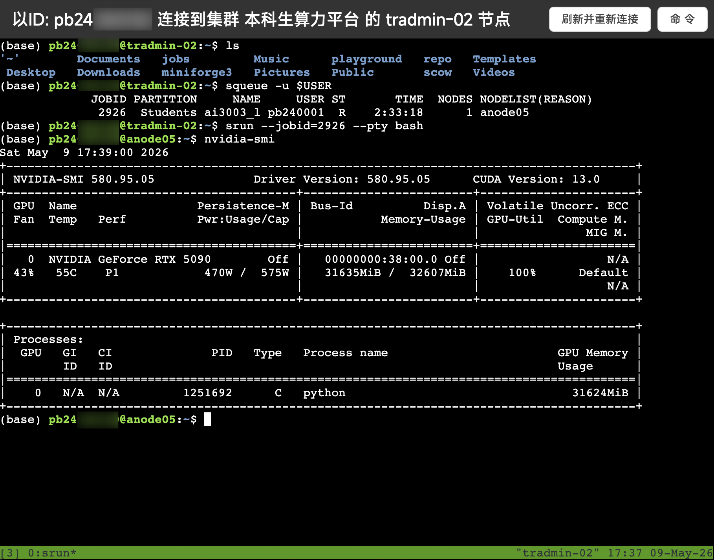
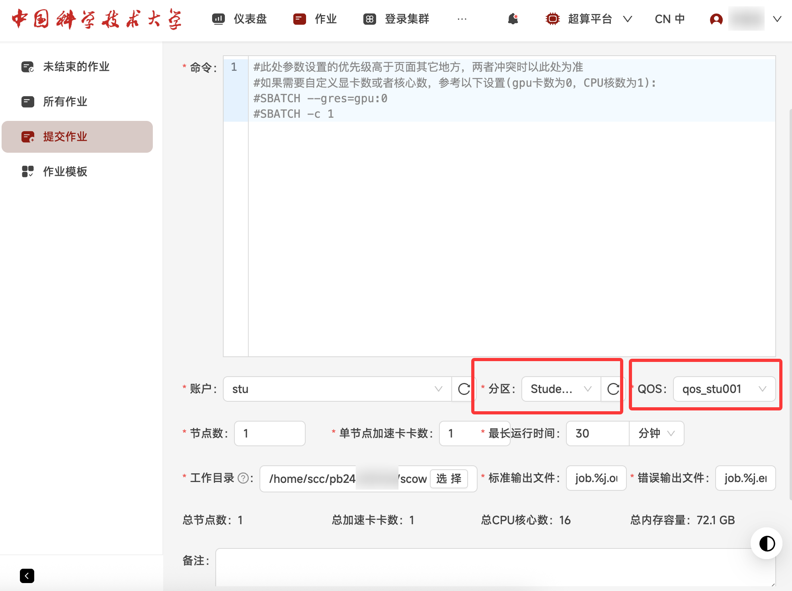

# 深度学习作业训练任务

本页面向需要把 PyTorch 等深度学习作业迁移到平台运行的同学。目标不是一次写出最优训练配置，而是先完成一条可复现路线：准备项目、配置环境、验证 GPU、提交 smoke test、查看日志，再扩大到正式训练。

!!! warning "资源参数待核验"
    GPU 型号、节点名、partition、QOS 和默认配额都属于动态事实，本文只说明字段含义和操作流程。正式提交前请以平台页面或课程通知为准。

## 适用场景

适合：

- 课程深度学习作业。
- PyTorch / TensorFlow 训练脚本。
- 需要 GPU 的模型实验。
- 从个人电脑迁移到平台运行的训练项目。

不适合直接跳到大规模正式训练。第一次迁移项目时，建议先跑小数据、小 batch、小步数的 smoke test。

## 你需要先知道

- 登录节点用于整理文件、配置环境和提交作业；训练应在计算节点运行。
- GPU 只有在申请到 GPU 资源后才可用。
- 作业脚本必须显式进入项目目录、激活环境、运行训练命令。
- 日志路径要固定，方便排查。



!!! note "截图说明"
    上图用于说明“通过作业进入计算节点后再查看 GPU”的检查方式。截图中的节点名、GPU 型号、作业 ID 和资源占用是当时示例，不代表当前固定配置。

## 1. 整理项目目录

运行环境：平台 Shell。

```bash
mkdir -p ~/projects/dl-homework/{src,data,logs,outputs,scripts}
cd ~/projects/dl-homework
```

建议结构：

```text
dl-homework/
  src/       # 训练代码
  data/      # 数据或数据链接
  scripts/   # sbatch 脚本
  logs/      # .out / .err 日志
  outputs/   # checkpoint、图表和结果
```

检查点：训练脚本、数据路径、日志路径和输出路径都能在项目目录中找到。

## 2. 配置 Python 环境

运行环境：平台 Shell。

```bash
conda create -n dl-homework python=3.10 -y
conda activate dl-homework
python -V
```

如果还没有安装 conda，请先参考[环境配置](../../basics/environments.md)中的 Miniconda 安装步骤。安装 PyTorch 时，应按平台 CUDA、驱动和课程要求选择版本，不要直接复制旧命令。

检查 GPU：

运行环境：已申请 GPU 的计算环境或 GPU 作业脚本。

```bash
nvidia-smi
python - <<'PY'
import torch
print(torch.__version__)
print(torch.cuda.is_available())
if torch.cuda.is_available():
    print(torch.cuda.get_device_name(0))
PY
```

检查点：在 GPU 环境中，`torch.cuda.is_available()` 应输出 `True`。

## 3. 写 smoke test

smoke test 是小步数测试，用来验证路径、环境、数据读取、GPU 和日志都正常。它应该在较短时间内结束，不追求模型效果。

建议训练脚本支持这些参数：

```bash
python src/train.py \
  --data data/sample \
  --output outputs/smoke \
  --epochs 1 \
  --batch-size 4
```

如果你的作业代码暂时不支持命令行参数，也可以先在配置文件中准备一份 `configs/smoke.yaml`。

## 4. 提交 GPU smoke test

以下模板使用常见默认分区和 QOS 写法。GPU 类型、CPU 数、内存和时间限制提交前仍需按当前平台界面确认。

运行环境：平台 Shell，保存为 `scripts/smoke.sbatch`。

```bash
#!/bin/bash
#SBATCH -J dl-smoke
#SBATCH -p Students
#SBATCH --qos=qos_stu_default
#SBATCH --gres=gpu:5090:1
#SBATCH --cpus-per-task=4
#SBATCH --mem=<memory>
#SBATCH -t 00:30:00
#SBATCH -o logs/%x-%j.out
#SBATCH -e logs/%x-%j.err

set -euo pipefail

cd ~/projects/dl-homework

set +u
source ~/miniconda3/etc/profile.d/conda.sh
conda activate dl-homework
set -u

nvidia-smi
python src/train.py \
  --data data/sample \
  --output outputs/smoke \
  --epochs 1 \
  --batch-size 4
```

提交：

```bash
sbatch scripts/smoke.sbatch
squeue -u "$USER"
```

检查点：

- `logs/` 下出现 `.out` 和 `.err`。
- `.out` 中有 `nvidia-smi` 输出和训练开始信息。
- `outputs/smoke` 下有结果、checkpoint 或至少有程序生成的输出。
- `.err` 没有 traceback、CUDA OOM 或找不到文件。

!!! note "GPU 类型"
    如果平台允许指定 GPU 类型，可用 `--gres=gpu:5090:1` 或 `--gres=gpu:A100:1` 这类写法。具体型号、节点状态和可用数量会变化，提交前请以平台界面或管理员说明为准。

## 5. 扩大到正式训练

smoke test 成功后，再逐步扩大：

1. 增加训练步数或 epoch。
2. 增加数据规模。
3. 调整 batch size。
4. 观察日志中的单步耗时、显存占用和验证指标。
5. 必要时再申请更多 CPU、内存、GPU 或运行时间。

不要一次性把所有参数调大。推荐先确认流程正确，再比较资源配置是否真的更快。



!!! note "截图说明"
    上图用于说明 GUI 中分区、QOS、GPU/CPU、运行时间、工作目录和日志字段的位置。截图里的具体分区、QOS、CPU 核数、GPU 型号和内存容量可能已经变化，提交前应以当前界面为准。

## 6. 常见问题

- `nvidia-smi` 不可用：确认命令是否在已申请 GPU 的环境中运行。
- 作业一直排队：先减少资源申请，或查看等待原因。
- `CUDA out of memory`：先减小 batch size、输入尺寸或模型规模。
- 没有日志：确认 `logs/` 目录存在，`#SBATCH -o/-e` 路径正确。
- 关闭浏览器后担心任务停止：正式训练应使用批处理作业提交，不依赖浏览器窗口。

更多排查见[常见问题](../../basics/faq.md)。

## 7. 结果归档

训练结束后建议把日志、配置和结果一起打包：

运行环境：平台 Shell。

```bash
cd ~/projects/dl-homework
tar -czf dl-homework-result-$(date +%Y%m%d).tar.gz logs outputs scripts
```

下载前先确认压缩包大小合理，不要把无关数据集和缓存一起打包。
